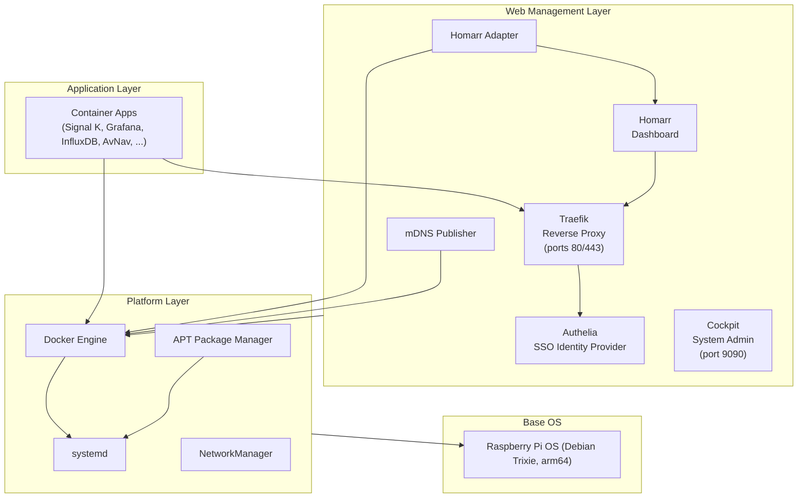
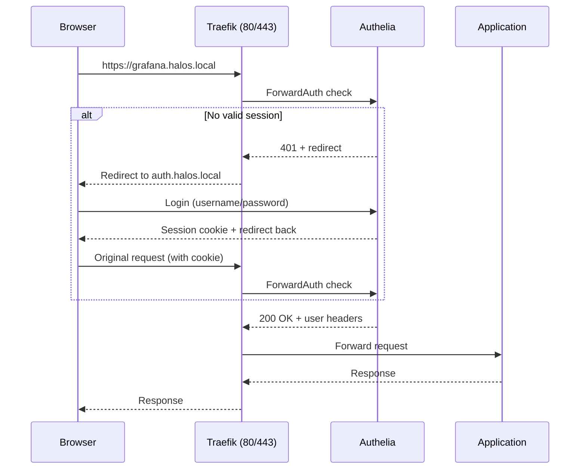

# Architecture Overview

How HaLOS is structured, from the base OS to the application layer.

## Design Principles

HaLOS follows a set of core design principles:

- **Container-first**: Applications run as Docker containers, managed as standard Debian packages
- **Web-managed**: All administration through browser interfaces -- no terminal required
- **Subdomain routing**: Each application gets its own subdomain (e.g., `grafana.halos.local`) instead of a port number
- **Single sign-on**: One login grants access to all web applications
- **Auto-discovery**: Installed apps automatically appear in the dashboard and get mDNS hostnames
- **Standard tooling**: Built on proven Debian technologies (APT, systemd, Docker)

## Layer Architecture

HaLOS is organized in four layers, each building on the one below:

### Layer 1: Base OS

Raspberry Pi OS based on Debian Trixie (arm64). Provides the Linux kernel, filesystem, networking, and hardware support. HALPI2 variants add drivers for CAN bus, RS-485, I2C, and power management.

### Layer 2: Platform

Standard Linux services that HaLOS builds on:

| Component | Role |
|-----------|------|
| **Docker** | Container runtime for all applications |
| **systemd** | Service management, startup ordering, timers |
| **APT** | Package installation and updates |
| **NetworkManager** | WiFi, Ethernet, and AP configuration |

### Layer 3: Web Management

The core HaLOS services that provide the unified web experience:

| Component | Role | Access |
|-----------|------|--------|
| **Traefik** | Reverse proxy, TLS termination, routing | Ports 80/443 |
| **Authelia** | SSO authentication (Forward Auth + OIDC) | `auth.halos.local` |
| **Homarr** | Dashboard landing page | `halos.local` |
| **Cockpit** | System administration | Port 9090 |
| **mDNS Publisher** | Subdomain advertisement via Avahi | Native service |
| **Homarr Adapter** | Container auto-discovery, first-boot setup | Native service |

### Layer 4: Applications

Container apps installed by the user. Each app is a Debian package containing a Docker Compose file, systemd service, and Docker labels for routing and dashboard integration.

## Component Diagram

The following diagram shows how a browser request reaches an application:

## Key Integrations

### App Installation Flow

When a container app package is installed via APT:

1. **APT** installs the `.deb` package (Docker Compose file, systemd service, icons)
2. **systemd** starts the container service
3. **Docker** pulls the image and starts the container
4. **Traefik** detects the new container's labels and creates a route
5. **mDNS Publisher** detects the `halos.subdomain` label and advertises the hostname
6. **Homarr Adapter** detects the `homarr.*` labels and adds a tile to the dashboard

All of this happens automatically -- the user just clicks "Install" in the app store.

### Networking

All proxied containers share a Docker bridge network called `halos-proxy-network`. Traefik routes requests based on the `Host` header to the appropriate container.

Apps using host networking (e.g., Signal K for hardware access) are routed via `host.docker.internal`. They retain direct port access alongside subdomain access.

## Further Reading

- [Reverse Proxy](reverse-proxy.md) -- Traefik configuration and routing
- [Single Sign-On](sso.md) -- Authentication architecture
- [Dashboard Integration](dashboard.md) -- Homarr auto-discovery
- [Package System](package-system.md) -- Container app packaging
