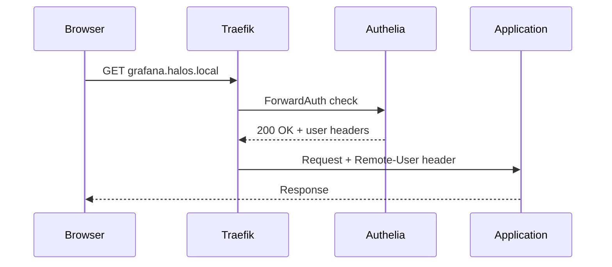
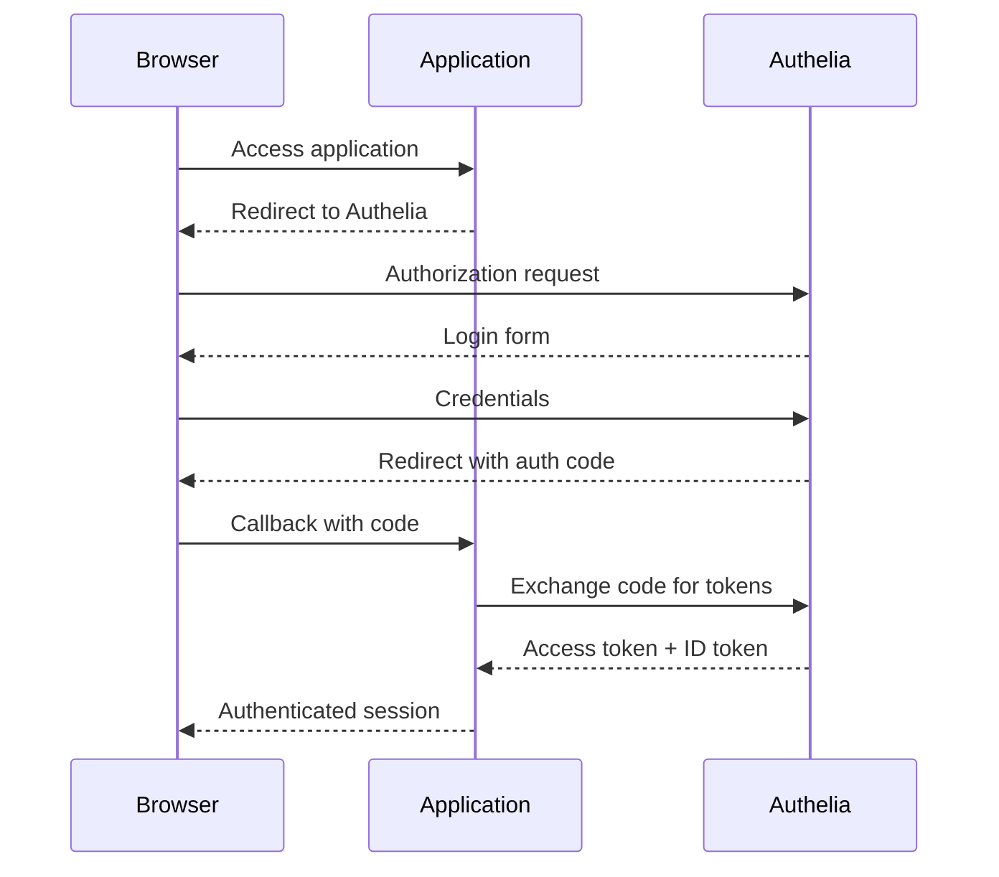

# Single Sign-On

HaLOS provides unified authentication across all web applications using Authelia as the identity provider and Traefik as the enforcement point.

## Overview

Instead of logging in to each application separately, users authenticate once with Authelia. The session cookie is shared across all `*.halos.local` subdomains, so navigating between applications is seamless.

Two authentication mechanisms are supported:

| Mechanism | How it works | Used by |
|-----------|-------------|---------|
| **Forward Auth** | Traefik checks each request with Authelia before forwarding | Most apps (Grafana, InfluxDB) |
| **OIDC** | App handles OpenID Connect flow directly with Authelia | Homarr, Signal K |
| **None** | No authentication enforced | AvNav, public dashboards |

## Authentication Modes

### Forward Auth (Default)

Forward Auth is the default for most applications. The application itself has no knowledge of authentication -- Traefik handles it transparently.



Authelia passes user identity to the application via HTTP headers:

| Header | Content |
|--------|---------|
| `Remote-User` | Username |
| `Remote-Groups` | Group memberships |
| `Remote-Email` | Email address |
| `Remote-Name` | Display name |

Some applications expect different header names. Per-app middleware can remap headers (e.g., Grafana expects `X-WEBAUTH-USER` instead of `Remote-User`).

### OIDC

Applications with native OpenID Connect support handle authentication directly with Authelia using the standard Authorization Code flow.



OIDC clients are registered with Authelia via configuration snippets. When an OIDC-enabled app is installed, its package drops a YAML snippet into `/etc/halos/oidc-clients.d/`. Authelia's prestart script merges all snippets into a single configuration file.

### No Auth

Applications can opt out of authentication entirely. They are accessible without login but still benefit from subdomain routing and TLS.

## User Database

Authelia uses a file-based user database (`users_database.yml`) with argon2id password hashes. On first boot, the default admin user is created with credentials from the branding configuration (default: `admin`/`halos`).

Users should change the default password immediately after first login via the Cockpit Users panel.

!!! info "Two Authentication Systems"
    HaLOS has two separate authentication systems:

    - **Authelia SSO** (`admin`/`halos`): Protects web applications behind Traefik
    - **Linux system auth** (`pi`/`halos`): Used by Cockpit (port 9090) and SSH

    These are independent. Changing one does not affect the other.

## Session Management

- Sessions are stored in a SQLite database backed by Valkey (Redis-compatible) for caching
- Session cookies are scoped to the `.halos.local` domain, enabling SSO across all subdomains
- Cookies are HTTP-only and Secure (when using HTTPS)
- Sessions expire after a configurable timeout

## OIDC Client Registration

When an OIDC-enabled container app is installed:

1. The Debian package installs a client snippet to `/etc/halos/oidc-clients.d/{app_id}.yml`
2. Authelia's prestart script reads all snippets from this directory
3. Client secrets are hashed and merged into `oidc-clients.yml`
4. Authelia loads the merged configuration on startup

Client snippet format:

```yaml
# /etc/halos/oidc-clients.d/homarr.yml
client_id: homarr
client_name: Homarr Dashboard
client_secret_file: /var/lib/container-apps/homarr-container/data/oidc-secret
redirect_uris:
  - 'http://${HALOS_DOMAIN}/api/auth/callback/oidc'
scopes: [openid, profile, email, groups]
consent_mode: implicit
```

When an OIDC app is removed, its `postrm` script deletes the snippet and Authelia regenerates the merged config on next restart.

## Security Considerations

- All traffic encrypted with TLS (self-signed wildcard certificate for `*.halos.local`)
- Containers communicate over an isolated Docker bridge network
- Only Traefik exposes ports to the host network (80, 443)
- OIDC private keys and client secrets have restricted file permissions (600)
- Passwords stored as non-reversible argon2id hashes
