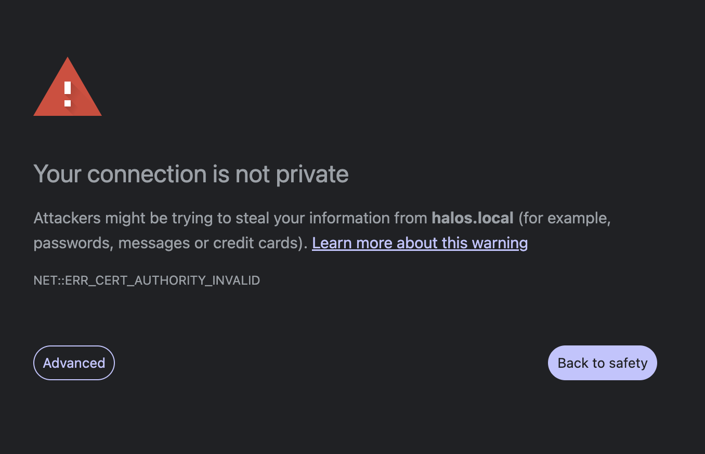

# First Boot

What to expect when you power on HaLOS for the first time.

## Boot sequence

After you insert the flashed SD card or SSD and power on:

1. **Linux boot** (~30 seconds) — Standard Raspberry Pi OS startup.
2. **First-boot initialization** (~1 minute) — HaLOS configures the system, generates certificates, and prepares container services.
3. **Container image download and startup** (~1–2 minutes) — Core containers (Traefik, Authelia, Homarr) are downloaded from the internet and started.

!!! important "Internet required"
    Container images are not included in the HaLOS image — they are downloaded on first boot. The device **must have internet access** before the main web interface becomes available. Without internet, only Cockpit on port 9090 is functional.

The total time from power-on to a working web interface is typically **2–3 minutes** (assuming an internet connection is available). During this time, the web interface at `https://halos.local/` will not respond — this is normal.

## Connecting to HaLOS

### Option 1: Ethernet (recommended)

1. Connect an Ethernet cable between your Raspberry Pi and your local network. This provides both internet access (for downloading containers) and local access.
2. Wait 2–3 minutes for containers to download and start.
3. Open a browser and go to **[https://halos.local/](https://halos.local/)**.

mDNS (`.local` hostname resolution) works on most operating systems out of the box. If `halos.local` doesn't resolve, check your router's DHCP client list for the device's IP address and use that instead.

### Option 2: WiFi access point (AP images only)

If you're using an [AP image variant](choosing-an-image.md#access-point-variant), the device creates a local WiFi hotspot — but this hotspot does **not** provide internet access. You need to configure a WiFi connection first:

1. On your laptop or phone, connect to the **`Halos-XXXX`** WiFi network (password: `halos1234`).
2. Open **[https://halos.local:9090/](https://halos.local:9090/)** — this is Cockpit, which runs natively without containers.
3. Log in with system credentials: username `pi`, password `halos`.
4. Go to **Networking** and connect the device to a WiFi network that has internet access.
5. Wait 2–3 minutes for the container images to download.
6. Open **[https://halos.local/](https://halos.local/)** to access the main web interface.

!!! tip
    After the device is connected to your WiFi network, you can switch your own laptop/phone back to the same WiFi network and access HaLOS from there.

## Certificate warning

HaLOS uses a self-signed TLS certificate to encrypt all web traffic. Your browser will show a security warning on first access. This is expected.

**How to proceed:**

- **Chrome**: Click "Advanced" → "Proceed to halos.local (unsafe)"
- **Firefox**: Click "Advanced…" → "Accept the Risk and Continue"
- **Safari**: Click "Show Details" → "visit this website"

!!! note "Expect multiple warnings"
    The warning appears once per hostname. Since HaLOS uses a separate subdomain for each service, you'll see this warning several times during initial setup — for `halos.local`, `auth.halos.local`, `cockpit.halos.local`, `signalk.halos.local`, and so on. This is a one-time annoyance per subdomain; after accepting, subsequent visits work without interruption.

!!! info "Why self-signed?"
    Automatic certificates from Let's Encrypt require a public domain name and internet-accessible ports 80/443. Since HaLOS runs on a local network with a `.local` mDNS hostname, self-signed certificates are the practical choice. Future versions may offer additional certificate options.

## Default credentials

HaLOS has two separate authentication systems:

### SSO login (Authelia)

Used for the main web interface and all applications behind the reverse proxy.

| | |
|---|---|
| **Username** | `admin` |
| **Password** | `halos` |

### System login (Cockpit / SSH)

Used for Cockpit direct access on port 9090 and SSH.

| | |
|---|---|
| **Username** | `pi` |
| **Password** | `halos` |

!!! danger "Change both passwords immediately"
    After first login, change the SSO password through the Authelia portal and the system password through the Cockpit Users panel. See [System Management](../user-guide/system-management.md).

## Backup access

If the main web interface at `https://halos.local/` isn't responding (for example, if a core container hasn't started yet), Cockpit is available directly at:

**[https://halos.local:9090/](https://halos.local:9090/)**

This bypasses Traefik and Authelia entirely. Log in with the system credentials (`pi` / `halos`). From Cockpit you can check service status, view logs, and troubleshoot.

## What you'll see

After logging in to the main interface, you'll land on the HaLOS dashboard — a Homarr-based app launcher showing tiles for all installed services.

From here you can:

- Click any tile to open that application
- Access Cockpit for system administration
- Install additional apps from the container store

## Next steps

- [Web Interface](../user-guide/web-interface.md) — Understand the web interface architecture
- [System Management](../user-guide/system-management.md) — Configure your system via Cockpit
- [Installing Apps](../user-guide/installing-apps.md) — Add applications from the container store
