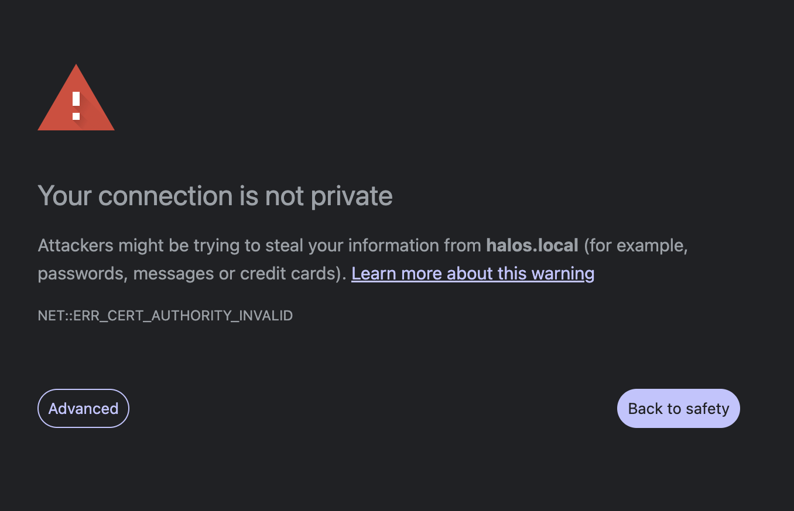
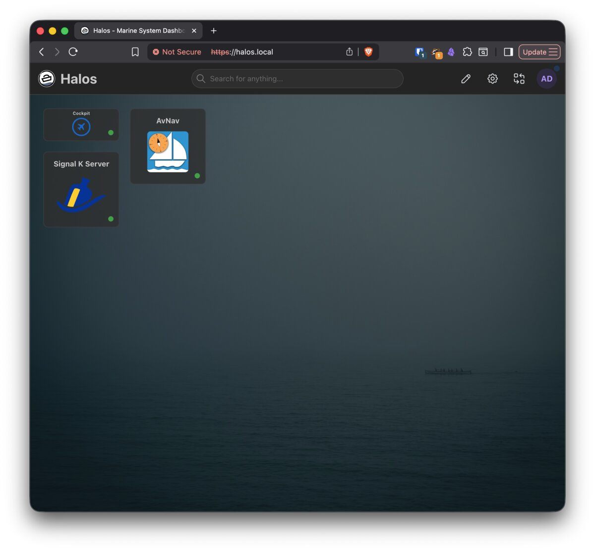

# First Boot

What to expect when you power on HaLOS for the first time.

## Boot sequence

After you insert the flashed SD card or SSD and power on:

1. **Linux boot** (~30 seconds) — Standard Raspberry Pi OS startup.
2. **First-boot initialization** (~1 minute) — HaLOS configures the system, generates certificates, and prepares container services.
3. **Container image download and startup** (~1–2 minutes) — Core containers (Traefik, Authelia, Homarr) are downloaded from the internet and started.

!!! important "Internet required"
    Container images are not included in the HaLOS image — they are downloaded on first boot. The device **must have internet access** before the main web interface becomes available. Without internet, only Cockpit on port 9090 is functional.

The total time from power-on to a working web interface is typically **2–3 minutes** (assuming an internet connection is available). During this time, the web interface at `https://halos.local/` will not respond — this is normal.

## Connecting to HaLOS

How you reach the device for the first time depends on your image and whether Ethernet is available. Pick the one that matches your setup.

### With Ethernet (recommended, any image)

1. Connect an Ethernet cable between the Raspberry Pi and your local network. This gives the device both internet access (for downloading containers) and local access.
2. Wait 2–3 minutes for containers to download and start.
3. Open **[https://halos.local/](https://halos.local/)**.

mDNS (`.local` hostname resolution) works on most operating systems out of the box. If `halos.local` doesn't resolve, check your router's DHCP client list for the device's IP address and use that instead.

### Desktop WiFi (Desktop images with a display)

With a monitor, keyboard, and mouse connected to the Pi, connect to WiFi from the desktop, just like any desktop Linux:

1. Click the NetworkManager applet in the top panel (right edge of the screen).
2. Select your WiFi network and enter the password.
3. Wait 2–3 minutes for containers to download and start.
4. Open **[https://halos.local/](https://halos.local/)** on the Pi or another device on the same network.

### WiFi access point (headless images and the AP desktop variant)

Headless images and the [AP desktop variant](choosing-an-image.md#access-point-variant) start their own WiFi hotspot on first boot, so you can reach the device without Ethernet or a display. The hotspot has **no internet** of its own — the goal of this step is to use it to point the device at a WiFi network that does.

1. On your laptop or phone, connect to the **`Halos-XXXX`** hotspot (password: `halos1234`).
2. Open **[https://halos.local:9090/](https://halos.local:9090/)**. This is Cockpit, which runs without containers and is reachable straight away.
3. Log in with the system credentials: username `pi`, password `halos`.
4. Go to **Networking**, click **WiFi (wlan0)**, pick a network with internet access, enter the password, and click **Add**. For more detail, see [WiFi through Cockpit](../user-guide/networking.md#wifi-through-cockpit).

When the device joins your network, it keeps the `Halos-XXXX` hotspot running and acts as a WiFi client at the same time. To do this it moves the hotspot onto your network's channel, so your laptop may **drop off `Halos-XXXX` for a few seconds and then reconnect on its own**. This is normal — wait for the connection to come back.

5. Wait 2–3 minutes for the container images to download and start.
6. Open **[https://halos.local/](https://halos.local/)** to reach the main web interface.

!!! tip
    You can stay on the `Halos-XXXX` hotspot to finish setup, or switch your laptop to the WiFi network you just configured — that network gives your laptop internet access too, and `halos.local` works from there as well.

## Certificate warning

HaLOS uses a self-signed TLS certificate to encrypt all web traffic. Your browser will show a security warning on first access. This is expected.

**How to proceed:**

- **Chrome**: Click "Advanced" → "Proceed to halos.local (unsafe)"
- **Firefox**: Click "Advanced…" → "Accept the Risk and Continue"
- **Safari**: Click "Show Details" → "visit this website"

!!! note "Certificate warnings per port"
    The certificate is issued for `halos.local` and covers all ports. However, browsers treat each port as a separate origin, so you'll see a certificate warning the first time you access each app's port (e.g., `:3000`, `:3001`). Cockpit on port 9090 uses its own certificate, so you'll see a separate warning for that too.

!!! info "Why self-signed?"
    Automatic certificates from Let's Encrypt require a public domain name and internet-accessible ports 80/443. Since HaLOS runs on a local network with a `.local` mDNS hostname, self-signed certificates are the practical choice. Future versions may offer additional certificate options.

## Default credentials

HaLOS has two separate authentication systems:

### SSO login (Authelia)

Used for the main web interface and all applications behind the reverse proxy.

| | |
|---|---|
| **Username** | `admin` |
| **Password** | `halos` |

### System login (Cockpit / SSH)

Used for Cockpit direct access on port 9090 and SSH.

| | |
|---|---|
| **Username** | `pi` |
| **Password** | `halos` |

!!! danger "Change both passwords immediately"
    After first login, change the SSO password through the Authelia portal and the system password through the Cockpit Users panel. See [System Management](../user-guide/system-management.md).

## Backup access

If the main web interface at `https://halos.local/` isn't responding (for example, if a core container hasn't started yet), Cockpit is available directly at:

**[https://halos.local:9090/](https://halos.local:9090/)**

This bypasses Traefik and Authelia entirely. Log in with the system credentials (`pi` / `halos`). From Cockpit you can check service status, view logs, and troubleshoot.

## What you'll see

After logging in to the main interface, you'll land on the HaLOS dashboard — a Homarr-based app launcher showing tiles for all installed services.

From here you can:

- Click any tile to open that application
- Access Cockpit for system administration
- Install additional apps from the container store

## Next steps

- [Web Interface](../user-guide/web-interface.md) — Understand the web interface architecture
- [System Management](../user-guide/system-management.md) — Configure your system via Cockpit
- [Installing Apps](../user-guide/installing-apps.md) — Add applications from the container store
