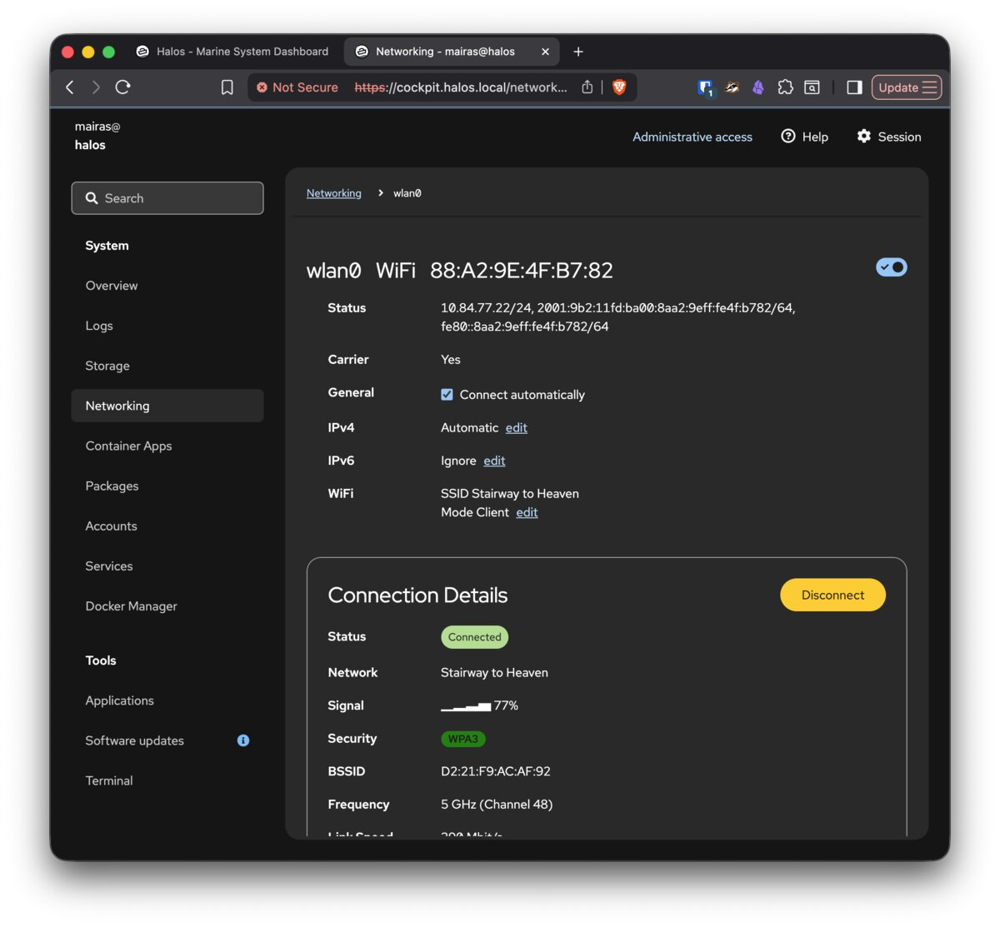

# Networking

HaLOS uses NetworkManager for network configuration, with Cockpit providing a web-based interface for managing connections.

## WiFi

### WiFi on Desktop images

If you're using a Desktop image with a monitor, keyboard, and mouse, connect to WiFi using the NetworkManager applet in the desktop top panel (right edge of the screen). Select a network, enter the password, and you're connected — just like any desktop Linux system.

### WiFi on headless images

Headless images have no desktop environment, so WiFi must be configured through Cockpit or the command line. All headless images include a built-in [WiFi access point](../getting-started/choosing-an-image.md#access-point-variant) for initial setup without Ethernet.

### WiFi through Cockpit

On any image, you can configure WiFi through the Cockpit NetworkManager module:

1. Open Cockpit → Networking.
2. Click on the WiFi interface.
3. Select a network from the list of available networks.
4. Enter the password and connect.

## Access point mode

All headless images and the `Halos-Desktop-Marine-HALPI2-AP` desktop variant create a WiFi access point on first boot:

- **Network name**: `Halos-XXXX` (XXXX is unique to your device)
- **Password**: `halos1234`

This allows you to connect and configure the device without Ethernet. Once connected to the AP, access the web interface at `https://halos.local/` and configure a regular WiFi connection through Cockpit → Networking.

After configuring a WiFi client connection, the access point is no longer needed for initial setup. Consult NetworkManager documentation for running AP and client mode simultaneously.

## Ethernet

Ethernet works out of the box with DHCP. The device obtains an IP address automatically from your network's DHCP server.

To configure a static IP:

1. Open Cockpit → Networking.
2. Click on the Ethernet interface.
3. Switch from "Automatic (DHCP)" to "Manual".
4. Enter the desired IP address, netmask, gateway, and DNS servers.

## Hostname and mDNS

HaLOS uses mDNS (multicast DNS) for local hostname resolution. The default hostname is `halos`, making the device reachable at `halos.local`.

Apps are accessed via path redirects on the base hostname (e.g., `halos.local/grafana/`), which redirect to dedicated HTTPS ports. Previously, per-app subdomains were advertised via mDNS (e.g., `grafana.halos.local`), but this was removed because Windows doesn't support multi-label `.local` mDNS names.

### Changing the hostname

If you change the device hostname (via Cockpit → Overview or `hostnamectl`), all URLs change accordingly. A device named `myboat` uses:

- `https://myboat.local/` — Dashboard
- `https://myboat.local/grafana/` — Grafana
- `https://myboat.local:9090/` — Cockpit direct access

After changing the hostname:

- The old `.local` name stops resolving. Update your bookmarks.
- TLS certificates are regenerated on next service restart to cover the new hostname.

## Troubleshooting network issues

**mDNS not resolving**: Some networks or client devices have issues with `.local` resolution. Try accessing by IP address instead. Check your router's DHCP client list for the device's IP.

**WiFi won't connect**: Verify credentials through Cockpit NetworkManager. Check Cockpit → Logs for NetworkManager entries. As a fallback, use Ethernet and configure WiFi from the wired connection.
