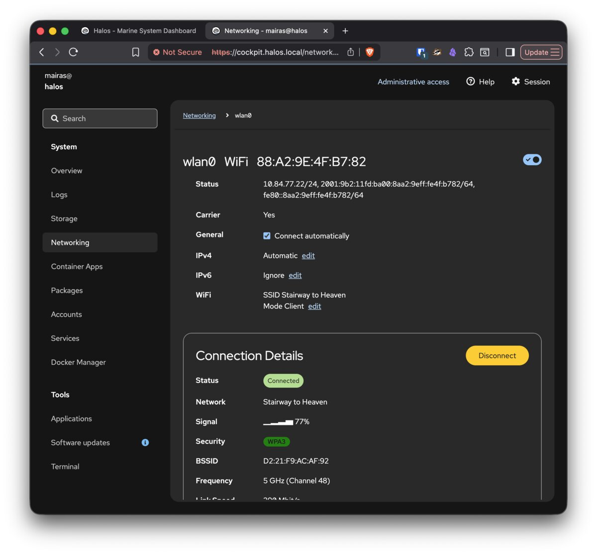

# Networking

HaLOS uses NetworkManager for network configuration, with Cockpit providing a web-based interface for managing connections.

## WiFi

### WiFi on Desktop images

If you're using a Desktop image with a monitor, keyboard, and mouse, connect to WiFi using the NetworkManager applet in the desktop top panel (right edge of the screen). Select a network, enter the password, and you're connected — just like any desktop Linux system.

### WiFi on headless images

Headless images have no desktop environment, so WiFi must be configured through Cockpit or the command line. All headless images include a built-in [WiFi access point](../getting-started/choosing-an-image.md#access-point-variant) for initial setup without Ethernet.

### WiFi through Cockpit

On any image, you can configure WiFi through the Cockpit NetworkManager module:

1. Open Cockpit → Networking.
2. Click **WiFi (wlan0)**.
3. Wait for the list of available networks to appear.
4. Click your network.
5. Enter the password and click **Add**.



## Access point mode

All headless images and the `Halos-Desktop-Marine-HALPI2-AP` desktop variant create a WiFi access point on first boot:

- **Network name**: `Halos-XXXX` (XXXX is unique to your device)
- **Password**: `halos1234`

This lets you reach the device without Ethernet. The hotspot has no internet of its own, so connect to it and open Cockpit at `https://halos.local:9090/`, then configure a WiFi client connection through Cockpit → Networking.

When the device joins a WiFi network, it keeps the hotspot running and acts as a client at the same time (concurrent AP and client). To do this it moves the hotspot onto the client network's channel, so a device connected to the hotspot may briefly disconnect and reconnect on its own. For the full first-time walkthrough, see [First Boot — WiFi access point](../getting-started/first-boot.md#wifi-access-point-headless-images-and-the-ap-desktop-variant).

### Serving more access point clients

The WiFi chip (Cypress CYW43455) has two firmware variants, and the system chooses between them with `update-alternatives`. The default `standard` variant accepts about 7 access point clients. The `minimal` variant is tuned for access point use and accepts about 19.

Use the `minimal` variant on any device whose hotspot is in real use. The client count is the smaller reason: in practice the `standard` variant seizes up with only a few clients connected, and then admits none at all.

Switch the variant:

```bash
sudo update-alternatives --config cyfmac43455-sdio.bin
```

Select the `cyfmac43455-sdio-minimal.bin` entry, then reboot. `update-alternatives` records the choice, so later firmware package updates keep it.

The `minimal` variant frees the chip memory for those extra client slots by dropping features:

- Automatic channel selection.
- DFS radar detection, so the 5 GHz channels that require it become unavailable.
- 802.11k/v/r roaming assistance and antenna diversity.

It is also an older firmware release than the `standard` variant (7.45.241 from 2021, against 7.45.265 from 2023).

If the hotspot does not come up after the switch, set a fixed channel on it, because the `minimal` variant cannot pick one on its own:

```bash
sudo nmcli connection modify Halos-AP wifi.band bg wifi.channel 6
```

To go back to the default firmware, run the same command and select the `standard` entry, or run `sudo update-alternatives --auto cyfmac43455-sdio.bin`.

## Ethernet

Ethernet works out of the box with DHCP. The device obtains an IP address automatically from your network's DHCP server.

To configure a static IP:

1. Open Cockpit → Networking.
2. Click on the Ethernet interface.
3. Switch from "Automatic (DHCP)" to "Manual".
4. Enter the desired IP address, netmask, gateway, and DNS servers.

## Hostname and mDNS

HaLOS uses mDNS (multicast DNS) for local hostname resolution. The default hostname is `halos`, making the device reachable at `halos.local`.

Apps are accessed via path redirects on the base hostname (e.g., `halos.local/grafana/`), which redirect to dedicated HTTPS ports. Previously, per-app subdomains were advertised via mDNS (e.g., `grafana.halos.local`), but this was removed because Windows doesn't support multi-label `.local` mDNS names.

### Changing the hostname

If you change the device hostname (via Cockpit → Overview or `hostnamectl`), all URLs change accordingly. A device named `myboat` uses:

- `https://myboat.local/` — Dashboard
- `https://myboat.local/grafana/` — Grafana
- `https://myboat.local:9090/` — Cockpit direct access

After changing the hostname:

- The old `.local` name stops resolving. Update your bookmarks.
- TLS certificates are regenerated on next service restart to cover the new hostname.

### Multiple interfaces on the same network

Connecting the device to one network over both Ethernet and WiFi usually works fine. In some cases, though, Avahi may register the hostname on more than one interface and rename it (e.g. to `halos-2.local`), leaving `halos.local` unresolvable. If you hit that, keep a single interface on a given network or put them on different networks. See [Troubleshooting — Device disappears or shows up as `halos-2.local`](troubleshooting.md#device-disappears-or-shows-up-as-halos-2local).

### Reaching the device from outside the LAN

mDNS only works on the LAN. For VPN or other off-LAN access, see [Remote Access](remote-access-vpn.md).

## Troubleshooting network issues

**mDNS not resolving**: Some networks or client devices have issues with `.local` resolution. Try accessing by IP address instead. Check your router's DHCP client list for the device's IP.

**WiFi won't connect**: Verify credentials through Cockpit NetworkManager. Check Cockpit → Logs for NetworkManager entries. As a fallback, use Ethernet and configure WiFi from the wired connection.
