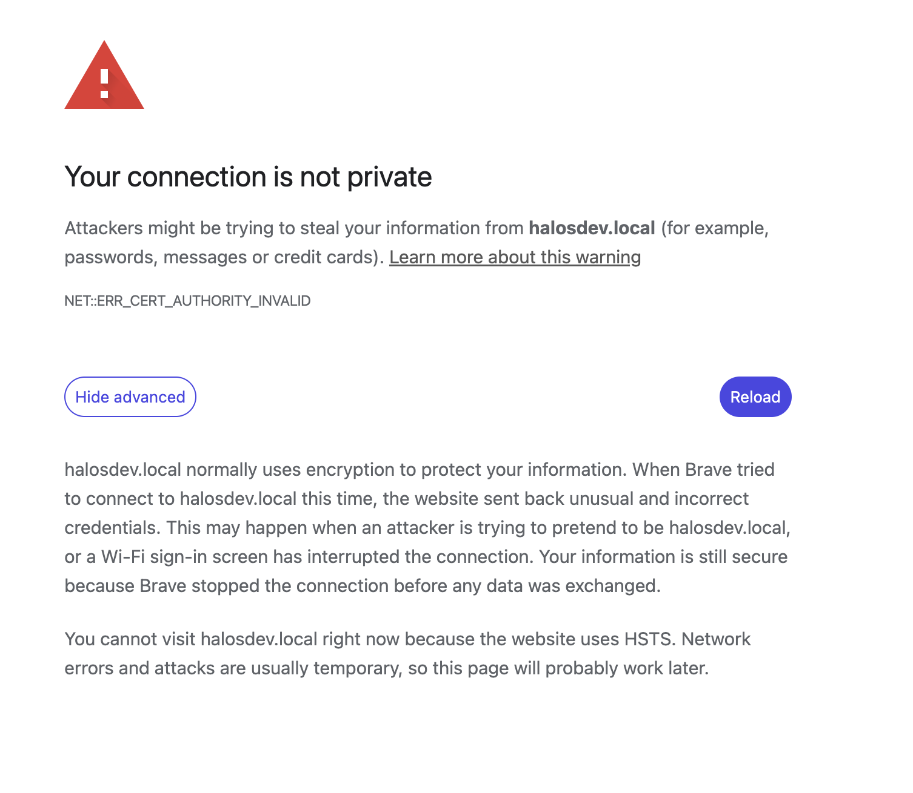

# Troubleshooting

Common issues and how to resolve them.

## Can't access the web interface

**Symptom**: Browser can't reach `https://halos.local/`.

**Possible causes and solutions**:

1. **No internet on first boot**: Container images are downloaded on first boot. Without internet, only Cockpit on port 9090 works. Connect via Ethernet or use the AP image to configure WiFi first — see [First Boot](../getting-started/first-boot.md#connecting-to-halos).

2. **Not enough time**: Core containers take 2–3 minutes to download and start after boot. Wait and try again.

3. **Hostname not resolving**: mDNS (`.local`) resolution depends on your client device and network. Try:
    - Accessing by IP address instead (check your router's DHCP client list)
    - Using a different device or browser
    - On Windows, ensure the Bonjour service is running

4. **Not on the same network**: Your device must be on the same local network as the Raspberry Pi. If using WiFi, ensure you're connected to the right network.

5. **Try Cockpit directly**: Cockpit runs independently on port 9090 and doesn't depend on Traefik or Authelia. Try `https://halos.local:9090/` — if this works, the issue is with the reverse proxy containers.

## Certificate warnings

**Symptom**: Browser shows a security warning when accessing any HaLOS URL.

This is **expected behavior**. HaLOS uses self-signed certificates because automatic certificates (Let's Encrypt) aren't possible on local `.local` networks.

Accept the certificate warning for each port as you encounter it — the same certificate covers all ports, but browsers treat each port as a separate origin.

See [First Boot — Certificate warning](../getting-started/first-boot.md#certificate-warning) for browser-specific instructions.

## Browser refuses to load the device after re-flashing

**Symptom**: After re-flashing the device, your browser shows a TLS error (e.g. `NET::ERR_CERT_AUTHORITY_INVALID`) and no "Proceed anyway" link is offered. The page mentions HSTS — for example, "You cannot visit halosdev.local right now because the website uses HSTS."



**Cause**: One of the apps behind the device proxy (Signal K Server in particular) used to emit a `Strict-Transport-Security` header on every response. As soon as your browser visited any per-app port — for example when you opened a Signal K plugin from the dashboard — Chromium-family browsers cached that HSTS state for the whole `halosdev.local` host (including subdomains) for a year. From then on, *any* TLS error on the host became non-overridable: no "Proceed anyway" link, only the `thisisunsafe` keystroke.

Re-flashing the device makes the symptom visible because the regenerated leaf certificate trips the HSTS-locked error, but the underlying cause is the cached HSTS pin from the earlier visit, not the cert rotation itself.

!!! info "Already fixed on current HaLOS versions"

    HaLOS now strips `Strict-Transport-Security` at the Traefik proxy before responses reach the browser, so devices running an up-to-date `halos-core-containers` package will not establish new HSTS state. If you upgraded an existing device and have HSTS pinned from a previous visit, you still need to clear it once using the steps below — but the lockout will not recur.

**Solution** — clear the HSTS pin for the hostname:

=== "Chrome / Brave / Edge"

    1. Open `chrome://net-internals/#hsts` (Brave: `brave://net-internals/#hsts`, Edge: `edge://net-internals/#hsts`).
    2. Scroll to **Delete domain security policies**.
    3. Enter the device hostname (e.g. `halos.local`) and click **Delete**.
    4. Reload the page — you'll get the normal "Not secure" warning, which you can now click through.

=== "Firefox"

    Firefox doesn't ship with HSTS preloaded for `.local` hostnames and typically isn't affected. If it is, clear the site-specific settings via **Preferences → Privacy & Security → Cookies and Site Data → Manage Data**, remove the entry for your device, and restart Firefox.

=== "Safari"

    Quit Safari, then remove the cached HSTS entry: `rm ~/Library/Cookies/HSTS.plist` and reopen Safari.

If you previously installed the device's CA on your workstation, the *old* CA is now stale and should be removed before installing the new one — see [Trust the device → Removing the trust anchor](trust-the-device.md#removing-the-trust-anchor).

## Container app store is empty

**Symptom**: The Container Apps section in Cockpit shows no applications.

**Solution**: Run a system update first:

```bash
sudo apt update && sudo apt upgrade
```

This downloads the latest package lists from the Hat Labs repository. After updating, the container store should show available apps.

## App not showing on the dashboard

**Symptom**: You installed an app but it doesn't appear on the Homarr dashboard.

**Check these in order**:

1. **Is the container running?** Check via Cockpit → Services or:
    ```bash
    sudo docker ps
    ```

2. **Wait for the adapter**: The `homarr-container-adapter` syncs containers to the dashboard periodically. Give it a minute after install.

3. **Check adapter logs**:
    ```bash
    sudo journalctl -u homarr-container-adapter -f
    ```

4. **Restart the adapter**:
    ```bash
    sudo systemctl restart homarr-container-adapter
    ```

## WiFi not connecting

**Symptom**: Can't connect to a WiFi network through Cockpit.

1. Open Cockpit → Networking and check the WiFi interface status.
2. Verify the WiFi credentials are correct.
3. Check Cockpit → Logs for NetworkManager errors.
4. If using an AP image, the device may be in AP mode. Switch to client mode through Cockpit NetworkManager.
5. As a fallback, connect via Ethernet and configure WiFi from the wired connection.

## SSH access

**Headless images**: SSH is enabled by default. Connect with:

```bash
ssh pi@halos.local
```

Default password: `halos`

**Desktop images**: SSH is disabled by default. Enable it via the Cockpit terminal or by connecting a keyboard and monitor:

```bash
sudo systemctl enable --now ssh
```

## Changed hostname, can't connect

**Symptom**: After changing the hostname, `halos.local` no longer works.

The old `.local` hostname stops resolving once the hostname is changed. Use the new hostname instead:

```
https://<new-hostname>.local/
```

If you've forgotten the new hostname, find the device by:

- Checking your router's DHCP client list for the device's IP address
- Connecting a monitor and keyboard to see the login prompt (which shows the hostname)
- Scanning the network: `ping -c1 halos.local` (if you haven't changed it) or use a network scanner

## Device disappears or shows up as `halos-2.local`

**Symptom**: `halos.local` stops resolving, or the device shows up under a numbered name like `halos-2.local`. This may happen when the device is connected to the same network over both Ethernet and WiFi.

**Cause**: With more than one interface on the same network, Avahi can register the hostname on each interface separately. The later registration finds the name already taken and falls back to a numbered variant (`halos-2.local`). If the interface holding the plain `halos.local` name is then disabled, only the numbered name is left advertised.

**Solution**: Keep a single interface on a given network — disconnect one, or put the interfaces on different networks. Then restart Avahi (or reboot) so the plain hostname re-registers:

```bash
sudo systemctl restart avahi-daemon
```

!!! note
    This is mDNS behaviour on multi-homed hosts, not a HaLOS bug. Both interfaces on one network usually works fine; the rename only shows up in corner cases.

## HALPI2 drops to initramfs on CM5 eMMC

**Symptom**: After flashing a HALPI2 image to a Compute Module 5's eMMC, the system drops to an `initramfs` BusyBox prompt instead of booting normally. The same image works fine when flashed to an NVMe SSD.

**Cause**: HALPI2 images disable the SD card interface (`dtparam=sd=off` in `config.txt`) to avoid a [known shutdown delay](https://github.com/raspberrypi/linux/issues/7014). On CM5, the eMMC uses the same controller, so disabling it prevents the kernel from finding the root filesystem.

**Solution**: After flashing and before booting, mount the boot partition on your computer and edit `config.txt`:

1. Find the line `dtparam=sd=off` (near the end of the file).
2. Comment it out by adding a `#` prefix:
    ```
    #dtparam=sd=off
    ```
3. Save, unmount, and boot.

!!! note
    This only affects CM5 eMMC. HALPI2 units with NVMe SSDs are not affected.

## Containers not starting

**Symptom**: Services show as failed or containers aren't running.

1. Check the service status:
    ```bash
    sudo systemctl status <service-name>.service
    ```

2. Check the container state and logs (container apps log to the journal):
    ```bash
    sudo docker ps -a
    sudo journalctl -u <service-name>.service -e
    ```

3. Check disk space — containers need room for images:
    ```bash
    df -h
    ```

4. Check if Docker is running:
    ```bash
    sudo systemctl status docker
    ```

## Getting help

- **[GitHub Discussions](https://github.com/halos-org/halos-distro/discussions)** — Ask questions and share ideas with the community
- **[GitHub Issues](https://github.com/halos-org/halos-distro/issues)** — Report bugs or request features
