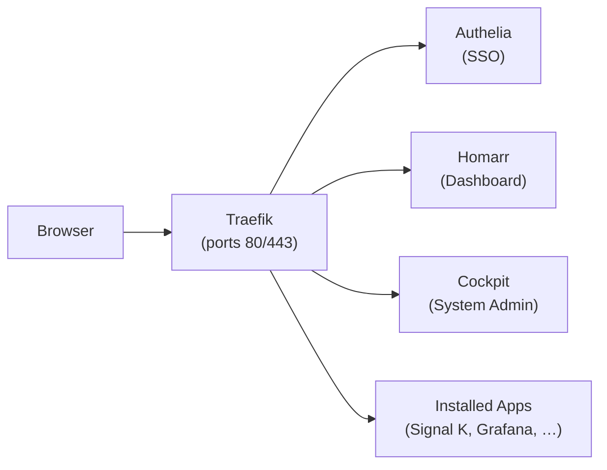

# Web Interface

HaLOS provides a unified browser-based interface for all system administration and application access. Everything runs through a reverse proxy with single sign-on — no port numbers to remember.

## Architecture

All web traffic flows through Traefik, which handles routing, TLS, and authentication:

- **Traefik** listens on ports 80 and 443, terminates TLS, and routes requests based on hostname.
- **Authelia** provides single sign-on. When you visit any protected service, Traefik checks with Authelia whether you have a valid session. If not, you're redirected to the login page.
- **Homarr** is the dashboard at the root URL — the first thing you see after login.
- **Cockpit** handles system administration (packages, services, networking, users).

## URL scheme

HaLOS uses **subdomain-based routing**. Each application gets its own subdomain:

| URL | Service |
|-----|---------|
| `https://halos.local/` | Homarr dashboard (home page) |
| `https://auth.halos.local/` | Authelia login portal |
| `https://cockpit.halos.local/` | Cockpit system management |
| `https://signalk.halos.local/` | Signal K server (marine) |
| `https://grafana.halos.local/` | Grafana dashboards (marine) |
| `https://influxdb.halos.local/` | InfluxDB admin (marine) |
| `https://avnav.halos.local/` | AvNav navigation (marine) |
| `https://opencpn.halos.local/` | OpenCPN chart plotter (marine) |

The exact subdomains available depend on which apps you have installed. Each subdomain is automatically advertised via mDNS so it resolves on your local network.

!!! note "Custom hostnames"
    If your device hostname isn't `halos`, replace `halos.local` with `<your-hostname>.local` throughout. For example, a device named `myboat` uses `https://myboat.local/` and `https://signalk.myboat.local/`.

## Login flow

1. You open `https://halos.local/` in your browser.
2. Traefik receives the request and checks with Authelia for a valid session.
3. Authelia redirects you to its login page at `https://auth.halos.local/`.
4. You enter your credentials (`admin` / `halos` by default).
5. Authelia sets a session cookie and redirects you back to the original URL.
6. Traefik sees the valid session and serves the Homarr dashboard.

The session cookie works across all `*.halos.local` subdomains, so you only log in once. Subsequent visits to any app are seamless.

## Navigation

**Homarr dashboard** is the hub — it shows tiles for every installed application. Click a tile to open that app in a new tab.

<!-- TODO: screenshot of Homarr with annotated navigation elements -->

**Cockpit** is the system admin interface. Access it from:

- The Cockpit tile on the dashboard
- Directly at `https://halos.local:9090/` (bypasses SSO, uses system credentials)

**App UIs** are accessed by clicking their dashboard tiles or navigating to their subdomain URLs directly.

## Cockpit direct access

Cockpit also runs independently on port 9090, outside the Traefik/Authelia stack. This provides a fallback if the reverse proxy is down and uses Linux system credentials (`pi` / `halos`) instead of SSO.

Access it at: `https://halos.local:9090/`

See [System Management](system-management.md) for details on what you can do in Cockpit.
