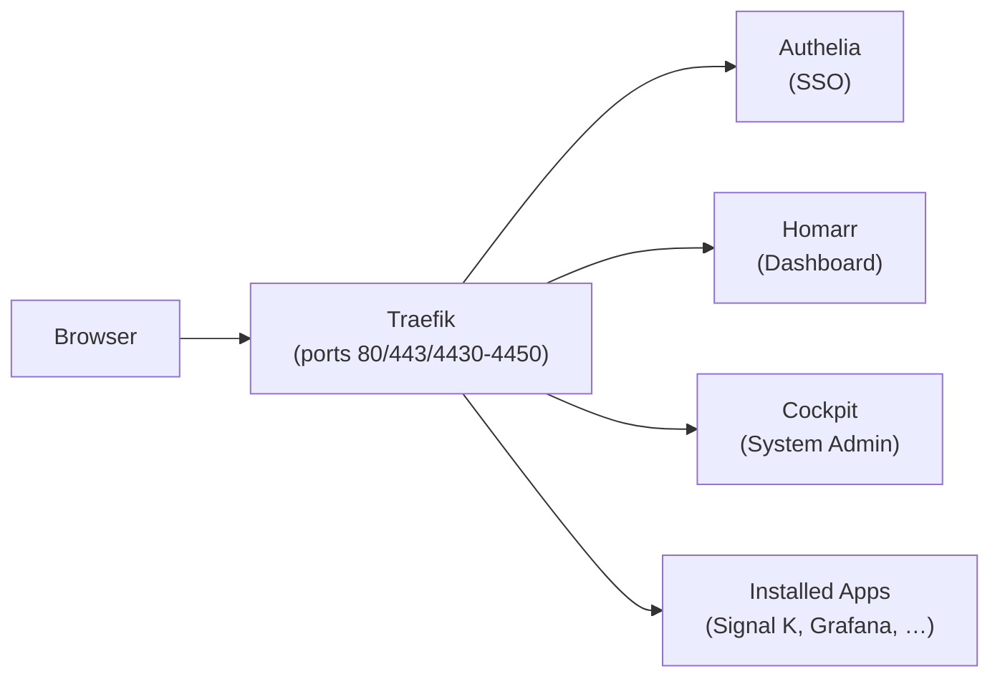

# Web Interface

HaLOS provides a unified browser-based interface for all system administration and application access. Everything runs through a reverse proxy with single sign-on.

## Architecture

All web traffic flows through Traefik, which handles routing, TLS, and authentication:

```mermaid
graph LR
    Browser --> Traefik["Traefik<br/>(ports 80/443/4430-4450)"]
    Traefik --> Authelia["Authelia<br/>(SSO)"]
    Traefik --> Homarr["Homarr<br/>(Dashboard)"]
    Traefik --> Cockpit["Cockpit<br/>(System Admin)"]
    Traefik --> Apps["Installed Apps<br/>(Signal K, Grafana, …)"]
```

- **Traefik** listens on ports 80, 443, and 4430–4450, terminates TLS, and routes requests to apps on dedicated HTTPS ports.
- **Authelia** provides single sign-on. When you visit any protected service, Traefik checks with Authelia whether you have a valid session. If not, you're redirected to the login page.
- **Homarr** is the dashboard at the root URL — the first thing you see after login.
- **Cockpit** handles system administration (packages, services, networking, users).

## URL scheme

HaLOS uses **port-based routing with path redirects**. Each application gets a dedicated HTTPS port, with a memorable path URL that redirects to it:

| URL | Service |
|-----|---------|
| `https://halos.local/` | Homarr dashboard (home page) |
| `https://halos.local/sso/` | Authelia login portal |
| `https://halos.local/cockpit/` | Cockpit system management (redirects to :9090) |
| `https://halos.local/signalk-server/` | Signal K server (marine) |
| `https://halos.local/grafana/` | Grafana dashboards (marine) |
| `https://halos.local/influxdb/` | InfluxDB admin (marine) |
| `https://halos.local/avnav/` | AvNav navigation (marine) |
| `https://halos.local/opencpn/` | OpenCPN chart plotter (marine) |

The path URLs (e.g., `halos.local/grafana/`) redirect to the app's dedicated HTTPS port. The exact apps available depend on which apps you have installed.

!!! note "Custom hostnames"
    If your device hostname isn't `halos`, replace `halos.local` with `<your-hostname>.local` throughout. For example, a device named `myboat` uses `https://myboat.local/` for the dashboard.

## Login flow

1. You open `https://halos.local/` in your browser.
2. Traefik receives the request and checks with Authelia for a valid session.
3. Authelia redirects you to its login page at `https://halos.local/sso/`.
4. You enter your credentials (`admin` / `halos` by default).
5. Authelia sets a session cookie and redirects you back to the original URL.
6. Traefik sees the valid session and serves the Homarr dashboard.

The session cookie works across all ports on `halos.local`, so you only log in once. Subsequent visits to any app are seamless.

## Navigation

**Homarr dashboard** is the hub — it shows tiles for every installed application. Click a tile to open that app in a new tab.

<!-- TODO: screenshot of Homarr with annotated navigation elements -->

**Cockpit** is the system admin interface. Access it from:

- The Cockpit tile on the dashboard
- Directly at `https://halos.local:9090/` (bypasses SSO, uses system credentials)

**App UIs** are accessed by clicking their dashboard tiles.

## Cockpit direct access

Cockpit also runs independently on port 9090, outside the Traefik/Authelia stack. This provides a fallback if the reverse proxy is down and uses Linux system credentials (`pi` / `halos`) instead of SSO.

Access it at: `https://halos.local:9090/`

See [System Management](system-management.md) for details on what you can do in Cockpit.
